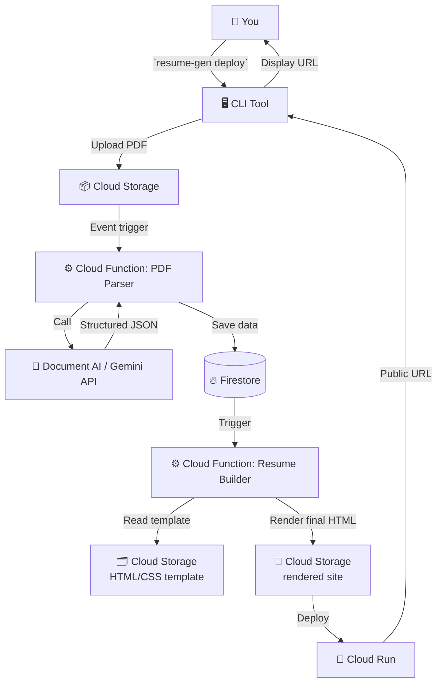

# ☁️ Cloud Resume Generator (crg)

[](https://cloud.google.com)
[](https://opensource.org/licenses/MIT)
[](http://makeapullrequest.com)

> One command to turn your PDF resume into a live, serverless website — powered by Google Cloud.


---

## 📌 Table of Contents
- [Why Use This?](#why-use-this)
- [Who Is It For?](#who-is-it-for)
- [Key Features](#key-features)
- [Architecture Overview](#architecture-overview)
- [How It Works (Functions)](#how-it-works-functions)
- [Google Cloud Services Used](#google-cloud-services-used)
- [Quick Start](#quick-start)
- [Limitations & Future Work](#limitations--future-work)

---

## 🎯 Why Use This?

Creating a personal website for your resume usually means:
- Buying a domain & hosting
- Writing HTML/CSS/JS from scratch or using CMS
- Managing servers or static hosts
- Updating every time your resume changes

**Cloud Resume Generator** solves all of that. It gives you a **production‑ready, serverless resume website** in under 2 minutes — using only your terminal.

### ✨ Benefits
- **Zero manual web design** – AI generates a clean, responsive layout from your PDF.
- **Always up‑to‑date** – Run the same command again to instantly refresh your live site.
- **Auto‑deployed** – Your resume lives on Google Cloud Run (serverless, scales to zero, costs $0 for low traffic).
- **Shareable URL** – Use it on LinkedIn, portfolio, or job applications.
- **100% open source** – Inspect, modify, and contribute.

---

## 👥 Who Is It For?

| Role | Why it matters |
| :--- | :--- |
| **Job seekers** | Stand out with a modern, live resume website. No tech skills needed beyond terminal. |
| **Developers** | See a complete serverless + AI example on GCP. Clone and learn. |
| **Recruiters** | View candidates' resumes in beautiful, responsive web format. |
| **Open source contributors** | Improve AI parsing, add themes, or optimize cost. |

---

## 🔥 Key Features

| Feature | Description |
| :--- | :--- |
| 🤖 **AI PDF parsing** | Uses Google Document AI (or Gemini) to extract name, experience, skills, education, etc. |
| 🎨 **Auto‑generated website** | Converts extracted data into a modern, mobile‑friendly HTML/CSS page. |
| ⚡ **Serverless deployment** | Hosted on Cloud Run – scales to zero when not used, so you pay nothing for low traffic. |
| 📊 **Resume quality score** | Vertex AI analyses your resume and gives a score (0–100) plus suggestions for improvement. |
| 🔁 **One‑command update** | `resume-gen deploy --file new-resume.pdf` replaces the old site instantly. |
| 🌍 **Custom domain ready** | (Optional) You can point your own domain (e.g., resume.yourname.com) to the generated URL. |
| 🛡️ **Secure by default** | IAM least‑privilege, secrets managed via Secret Manager, API restricted. |
| 📈 **Usage metrics** | Integrated with Cloud Monitoring – see how many people viewed your resume. |

---

## 🧱 Architecture Overview

Below is the high‑level workflow of how your PDF becomes a live website.



## ⚙️ How It Works (Functions)

The project is built as a collection of small, single‑purpose serverless functions.

### 1. **CLI Tool** (`resume-gen`)
- Written in Python (Click library).
- Authenticates with GCP using your default credentials.
- Uploads the user‑specified PDF to a Cloud Storage bucket.
- Polls for completion and prints the final URL.

### 2. **PDF Parser (Cloud Function)**
- Triggered when a new PDF is uploaded.
- Calls **Document AI** (or Gemini API) to extract text and structured fields (name, email, work history, etc.).
- Stores the extracted JSON in Firestore under `resumes/{user_id}`.
- On failure, logs error and sends a notification (optional).

### 3. **Resume Builder (Cloud Function)**
- Triggered by Firestore document creation/update.
- Fetches the extracted JSON and a pre‑designed HTML template from Cloud Storage.
- Injects data into the template (using Jinja2 or similar).
- Uploads the final HTML file to another Cloud Storage bucket (or builds a container image for Cloud Run).

### 4. **Cloud Run Service**
- Serves the static HTML/CSS website.
- Configured with **min instances = 0** (scales to zero when idle).
- Uses **Cloud CDN** optionally for faster global delivery.
- Custom domain mapping via Cloud Load Balancing.

### 5. **Quality Scoring (Optional)**
- Another Cloud Function calls **Vertex AI** with the extracted resume text.
- Returns a score and list of missing keywords or weak points.
- Shown in the CLI after deployment.

---

## ☁️ Google Cloud Services Used

| Service | Purpose |
| :--- | :--- |
| **Cloud Run** | Hosts the final resume website (serverless container). |
| **Cloud Functions (2nd gen)** | PDF parsing and resume building logic. |
| **Document AI / Gemini API** | Extracts structured data from PDF. |
| **Vertex AI** | (Optional) Provides quality score and suggestions. |
| **Firestore** | Stores user resume data (NoSQL). |
| **Cloud Storage** | Stores uploaded PDFs, HTML templates, temp files. |
| **Secret Manager** | Holds API keys and service account credentials. |
| **Cloud Monitoring & Logging** | Tracks errors, latency, and usage. |
| **Cloud Scheduler** | (Optional) Runs weekly cost‑report or cleanup job. |
| **Terraform** | Infrastructure as Code – defines all resources. |

*(All services used within Google Cloud Always Free tier limits – see pricing section.)*

---

## 🚀 Quick Start (First Half)

### Prerequisites
- [Google Cloud account](https://cloud.google.com/free) ($300 free credit + Always Free tier)
- [gcloud CLI](https://cloud.google.com/sdk/docs/install) installed and authenticated
- [Python 3.9+](https://www.python.org/downloads/) and pip
- Git
```


### 1. Clone the repository
```bash
git clone [https://github.com/rajim59/resume-gen.git](https://github.com/rajim59/resume-gen.git)
cd resume-gen
```

### 2. Set up environment
```bash
python -m venv venv
source venv/bin/activate   # On Windows: venv\Scripts\activate
pip install -r requirements.txt
```

### 3. Configure GCP project
```bash
gcloud config set project YOUR_PROJECT_ID
gcloud auth application-default login
```

### 4. Deploy the infrastructure (Terraform)
```bash
cd infra
terraform init
terraform apply -auto-approve
```

### 5. Install the CLI tool locally
```bash
pip install -e cli/
```

### 6. Generate your resume website
```bash
resume-gen deploy --file /path/to/your-resume.pdf
```

After 30–90 seconds, you’ll see:
```
✅ Deployment successful!
Live URL: [https://resume-xyz-uc.a.run.app](https://resume-xyz-uc.a.run.app)
```

Open the link in your browser – your resume is live!
